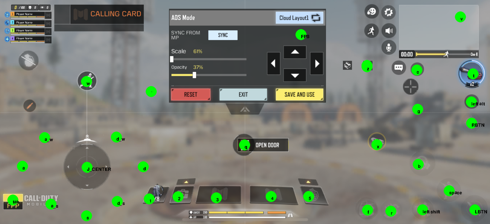
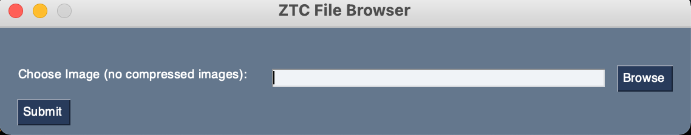

# ZXTouch-Python-Client
A generic zxtouch python client for Windows/Mac/Linux for keyboard gaming (CoDm, PUBG, etc...)<p></p>
If this helped you out, Buy me a coffee [here](https://buymeacoffee.com/modderan)

## Description
Linked and dependant on this project... https://github.com/xuan32546/IOS13-SimulateTouch<p></p>
This is a client that maps keyboard/mouse functionality for any game.  You will need to modify coordinates `config.json` file for your specific game, but out of the box this will support CoDm on iPhone11 with the attached layout.

## Features
* Functional resolution coordinate mapping and realtime plotting (via debug mode).
* Screen input locking (FPS).
* Importable screenshot of actual layout for button mapping (similar to ZXTouch.net site).
* Automatic screen size calculations (based on uploaded image size).
* No need to login to a website to run coordinate as this is stored locally to the script.
* Buttons are already mapped and working for iPhone XR/11 (1792x828) resolution (see screenshot for working mappings).
* Button programming and joystick centering mode available for your custom layout.
* Fully working on OSX Big Sur, should also work on windows, but have not tested.
* Will likely need to input device IP (127.0.0.1 did not work for me).



## Usage
1. **Change into the ZXTouch Client directory.**
```bash
cd /path/to/ZXtouch-CoDm-Client/
```

2. **Install python dependencies.**
```bash
pip install -r requirements.txt
```

3. **Launch the program via a terminal or cmd window (you can exclude the IP if connected via USB to Windows w/ Itunes installed "127.0.0.1" will be used)**
```
python3 main.py <IP Address of device>
```

4. **A file browser box will pop up the first time you run the script asking for a screen shot of you game button layout (ensure this is a non compressed image), select the file and click "submit".**




## How to set keys

### Map Keys
1. Press `k` to enter key programming mode (when you press `k` all current mapping locations will print to the image).
2. Press the key you want to program, then click the left mouse button once on the location for the key.
3. Confirmation of the programmed key will be signified by a blue dot and the key next to it on the background image and shown in the console output.
4. Press another key you want to program and follow steps 2-3 again or press `k` again to exit key programming mode.

### Map Joystick Center
1. Press `j` to enter joystick programming mode.
2. The center of the joystick will already be selected so all you need to do is click the left mouse button in the center of your games joystick location.
3. Confirmation of joystick center will be signified by a blue dot and `J_CENTER` on the background image and shown in the console output.
4. Press `j` again to exit key programming mode.